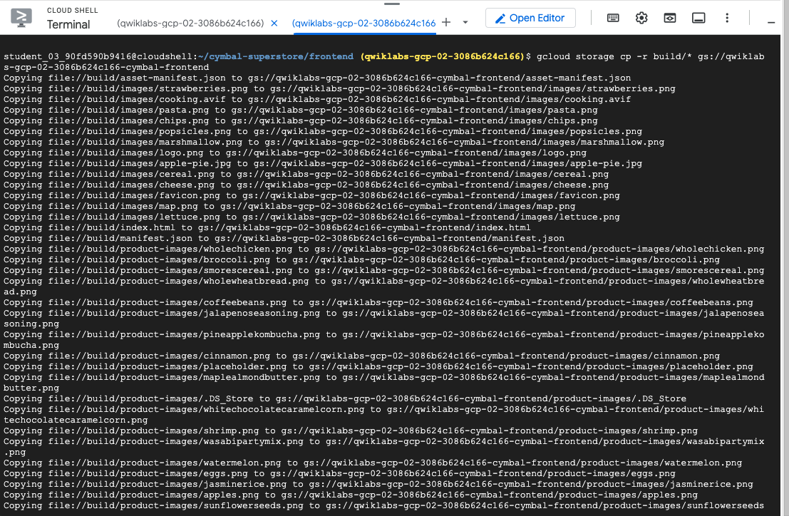
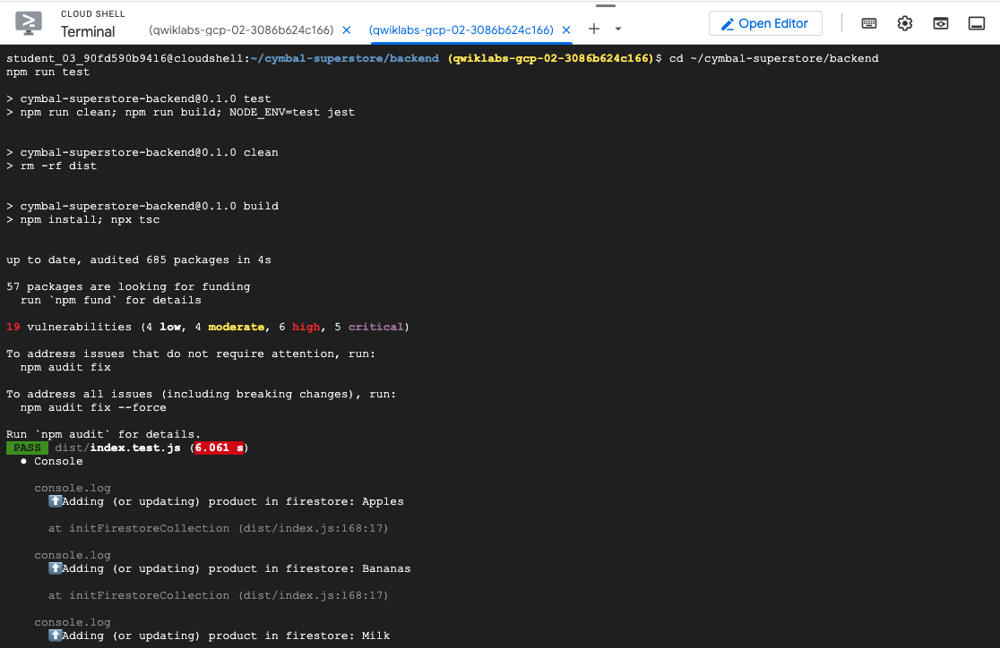

# GCP-LAB-Using-Gemini-Throughout-the-Software-Development-Lifecycle
Using Gemini Throughout the Software Development Lifecycle

##### Objectives
In this lab, you use Gemini to perform the following tasks:

. Use Gemini Code Assist in the Cloud Shell editor to build a web application.
. Deploy the application to Cloud Run.
. Prompt Gemini to explain an error in the application and provide a fix.
. Develop integration tests for the application with help from Gemini.
. Use Gemini Cloud Assist with BigQuery to learn how to load data in a table, and to generate and explain a query.
. Use Gemini Cloud Assist with Spanner to query transaction data.
. Learn how to view application logs with help from Gemini Cloud Assist.

### Task 1. Configure your environment and account

1. Sign in to the Google Cloud console with your lab credentials, and open the Cloud Shell terminal window.

2. To set your project ID, in Cloud Shell, run the following commands:

```
PROJECT_ID=$(gcloud config get-value project)
echo "PROJECT_ID=${PROJECT_ID}"

```

3. Store the signed-in Google user account in an environment variable:

```
USER=$(gcloud config get-value account 2> /dev/null)
echo "USER=${USER}"
```

4. Enable the Cloud AI Companion API for Gemini:

gcloud services enable cloudaicompanion.googleapis.com --project ${PROJECT_ID}

5. To use Gemini, grant the necessary IAM roles to your Google Cloud Qwiklabs user account:

```
gcloud projects add-iam-policy-binding ${PROJECT_ID} --member user:${USER} --role=roles/cloudaicompanion.user
gcloud projects add-iam-policy-binding ${PROJECT_ID} --member user:${USER} --role=roles/serviceusage.serviceUsageViewer

```

Adding these roles lets the user use Gemini assistance.


### Task 2. Build the web app

This lab uses the Cymbal Superstore grocery web app. In subsequent tasks of this lab, you use Gemini to develop and deploy a new feature in this app. In this task, you build the frontend and backend components of this app.

###### Configure the environment

Execute the following commands and the next two subtasks in Cloud Shell.

1. To run the Docker credential helper, run the following command:

```
gcloud auth configure-docker

```


2. If asked to continue, type Y.

Download the cymbal-superstore application code:

```
gcloud storage cp -r gs://cloud-training/OCBL435/cymbal-superstore .
```


##### Build the backend

The web app backend implements an inventory API that is used by the frontend to fetch and update products.

1. To build the backend application container image, run the following commands:

```
cd ~/cymbal-superstore/backend
docker build --platform linux/amd64 -t inventory container image url .

```


2. Push the backend container image to Artifact Registry:

```
docker push inventory container image url

```


3. To deploy the backend as a service on Cloud Run, run the following command:

```
gcloud run deploy inventory --image=inventory container image url --port=8000 --region=set at lab start --set-env-vars=PROJECT_ID=Google Cloud Project ID --allow-unauthenticated

```


4. Copy the value of the Service URL that is displayed in the output of the gcloud run deploy command.

>Service URL: https://inventory-567073492737.us-east4.run.app

##### Build the frontend

Build the frontend by executing the commands in your Cloud Shell terminal.

1. Update the frontend code to connect to your backend Cloud Run endpoint:

a. In the Cloud Shell menubar, click Open Editor.

b. In the editor View menu, click Toggle hidden files.

c. In the folder list in Explorer, select cymbal-superstore.

d. Expand the frontend folder, and select the file .env.production.

e. In the file, replace the value of REACT_APP_INVENTORY_API_URL by pasting the value of your Cloud Run backend service endpoint URL that you copied earlier.


2. To build the frontend, click Open Terminal, and then run the following commands in Cloud Shell:

```
cd ~/cymbal-superstore/frontend
npm install && npm run build

```


3. To upload the frontend web app to Cloud Storage, run the following command:

```
gcloud storage cp -r build/* gs://frontend cloud storage bucket name
```




##### View the web app

1. Open a tab in your browser, and then navigate to the following URL:

```
http://frontend IP address

```

>Note: If you get a pop-up indicating that the external IP doesn't support a secure connection, click Continue to site.

The web app displays the home page of the Cymbal Superstore.


2. Click New Arrivals.

You should see a mock frontend page with placeholder products. This is expected, as you will implement the backend Inventory API code to serve the new products page in subsequent tasks of this lab.


### Task 3. Modify the web app backend

Let's now use Gemini to add functionality to our web app backend.

In this task, you prompt Gemini for code completion to implement the /newproducts endpoint in the app.


###### Develop the /newproducts endpoint

1. In the Cloud Shell editor, open the file backend/index.ts.

2. In the index.ts source code file, scroll to line 91 where you see the placeholder comment for the /newproducts endpoint:

// Your code for the GET /newproducts endpoint goes here.


3. Replace the placeholder comment with the following Gemini prompt:

// Create a new endpoint /newproducts that uses where filters to retrieve only products that were added within the last seven days and are in stock.
Copied!

4. To prompt Gemini to generate the function code, select the entire comment, and then click the bulb (Code OSS Gemini bulb).

5. In the More Actions menu, select Gemini: Generate code.

6. Hover over the generated code, and in the Gemini toolbar, click Accept.

Gemini populates the function code for the /newproducts endpoint.

>Note: Gemini might generate multiple versions of the code for your prompt. You can choose a specific version by scrolling through the list in the toolbar.

The generated code should be similar to the following:

```

app.get("/newproducts", async (req: Request, res: Response) => {
  const sevenDaysAgo = new Date(Date.now() - 7 * 24 * 60 * 60 * 1000); // 7 days ago
  const products = await firestore
    .collection("inventory")
    .where("timestamp", ">=", sevenDaysAgo)
    .where("quantity", ">", 0)
    .get();
  const productsArray: any[] = [];
  products.forEach((product) => {
    const p: Product = {
      id: product.id,
      name: product.data().name,
      price: product.data().price,
      quantity: product.data().quantity,
      imgfile: product.data().imgfile,
      timestamp: product.data().timestamp,
      actualdateadded: product.data().actualdateadded,
    };
    productsArray.push(p);
  });
  res.send(productsArray);
});

```

7. If your generated code does not look equivalent to the example in the previous step, replace the code in index.ts with the code from the previous step.

>Remove any additional or incomplete function code that might be added to the source file by Gemini.


### Task 4. Test the app locally

Let's test the /newproducts backend endpoint locally using npm.

##### Set the PORT environment variable

Before running the backend, you must set the PORT environment variable.

1. In the Cloud Shell editor menubar, select View > Command Palette....

2. In the command palette, type user settings json, and from the list, select Preferences: Open User Settings (JSON).

3. Update the JSON object by adding the following attribute:

```
"terminal.integrated.env.linux": {
    "PORT": "8000"
}
```

>Make sure to append a comma to the end of the previous attribute in the JSON object.

After adding the attribute, the attributes object should be similar to this:

```

{
  "window.menuBarVisibility": "classic",
  "window.commandCenter": true,
  "http.proxySupport": "off",
  "workbench.startupEditor": "welcomePageInEmptyWorkbench",
  "redhat.telemetry.enabled": false,
  "workbench.layoutControl.enabled": false,
  "window.autoDetectColorScheme": true,
  "geminicodeassist.project": "cloudshell-gca",
  "terminal.integrated.defaultProfile.linux": "Google Cloud Shell",
  "terminal.integrated.env.linux": {
    "PORT": "8000"
  }
}

```


###### Run the backend server

1. In the Cloud Shell terminal, authenticate the application to access Firestore:


```
gcloud auth application-default login 

```


2. Follow the instructions by clicking the link to authenticate your Google Cloud account and copy/paste the authorization code where requested.

3. To start the backend server, run the following commands:

```
cd ~/cymbal-superstore/backend
npm run start

```


The backend inventory API server starts and is ready when it shows the following text:

>Cymbal Superstore: Inventory API running on port: 8000


###### Invoke the /newproducts endpoint

1. In the Cloud Shell terminal menu bar, click + to open a new terminal.

2. To invoke the API endpoint, run the following command:

```
curl localhost:8000/newproducts

```

The command responds with an error:

`curl: (52) Empty reply from server`


3. In the original terminal window view the exception trace that is logged from the backend.

From the trace, it seems that the root cause of the exception is:

```
details: ...'The query contains range and inequality filters on multiple fields, please refer to the documentation for index selection best practices: https://cloud.google.com/firestore/docs/query-data/multiple-range-fields.',

```


### Task 5. Fix the backend with help from Gemini Code Assist

Get help from Gemini Code Assist

1. In the Cloud Shell editor, open the backend/index.ts file.

2. To open the Gemini Code Assist chat window, in the menu bar of the code editor, click Gemini Code Assist Chat.


3. In the Ask Gemini prompt, type the following prompt, and then click Send (Gemini send):

```

Help me debug this Firestore client error: The query contains range and inequality filters on multiple fields

```


Gemini responds with the explanation of this error and suggestions to fix it. Here's part of an example response:

 "The query contains range and inequality filters on multiple fields" in Firestore arises when you try to use range operators (like >, >=, <, <=) or inequality operators (!=) on more than one field in a single query. Firestore's indexing limitations prevent it from efficiently handling such queries.<p>Gemini also provides a solution to fix the error.</p>

>Note: Gemini can generate different responses each time it's run, so your response may not match the example shown.

To fix this error, you will only use a single inequality filter.

4. In the backend/index.ts file, to remove the quantity filter, delete the following code from the /newproducts handler:

```
.where("quantity", ">", 0)

```

By deleting this code, there is now only one inequality filter that checks the timestamp, products with a quantity of 0 will not be filtered from the API response.

5. To remove products that have a quantity of 0, wrap the code in products.forEach() with the following if statement:

```
if (product.data().quantity > 0) {
}
```
After you wrap the code with the if statement, the products.forEach() code should look similar to:

```
products.forEach((product) => {
  if (product.data().quantity > 0) {
    const p: Product = {
      id: product.id,
      name: product.data().name,
      price: product.data().price,
      quantity: product.data().quantity,
      imgfile: product.data().imgfile,
      timestamp: product.data().timestamp,
      actualdateadded: product.data().actualdateadded,
    };
    productsArray.push(p);
  }
});

```


6. Save the backend/index.ts file.

###### Re-test the API

1. To restart the backend API server, in a terminal, run the following commands:

```
cd ~/cymbal-superstore/backend
npm run start

```


2. Switch to the other bash terminal, and then run the curl command again:

```curl localhost:8000/newproducts```


The backend API responds with a json array that contains a list of recently added products.

3. In the original Cloud Shell terminal, type Control+C to exit the application.


### Task 7. Develop tests with help from Gemini

In this task, you write a test for the new products API in the backend with help from Gemini.

##### Develop the test

1. In the Cloud Shell editor, open the file backend/index.test.ts.

>Note: This file contains a few simple tests that are developed with a tool called supertest, using the Jest testing framework.

2. To open the Gemini Code Assist chat window, in the menu bar of the code editor, click Gemini Code Assist Chat.

3. To prompt Gemini to help you write a test for the GET endpoint /newproducts, type the prompt below, and click Send (Gemini send):

```
Help me write an Express.js test using Jest, in typescript, for the GET /newproducts handler in index.ts. The test should check if the response code is 200 and the list of new products is length 8.

```


4. Gemini responds with the generated test code. Copy and paste the describe code block for the /newproducts endpoint into the backend/index.test.ts file.

>Note: Copy only the describe code block. You do not need to copy the import statements in the example.


###### Run the test

1. To execute the tests, in the Cloud Shell terminal run the following commands:

```
cd ~/cymbal-superstore/backend
npm run test

```




2. As indicated by the output of the test command, all tests are executed and pass.

>Note: The output also indicates that the test suite failed to run due to the Jest environment being torn down. You can ignore this error and move to the next task.


### Task 8. Use Gemini with BigQuery

In this task, you get help from Gemini to upload data to a table in BigQuery, and construct a query that fetches data from that table.

###### Upload data to BigQuery
1. In the Google Cloud console Navigation menu (navmenu), select BigQuery.

2. In the BigQuery Explorer pane, expand Google Cloud Project ID, expand the cymbal_sales dataset, and then select the table cymbalsalestable.

>Note: The dataset and table have been pre-provisioned for this lab. Data for the table is in CSV format, and is stored in a bucket in Cloud Storage.

3. To open the Gemini Cloud Assist chat window, in the Google Cloud console top menu, click Open Gemini (Gemini menu), and then click Start Chatting.

4. For the Gemini prompt, type the text below, and then click Send (Gemini send):

```
What bq command can be used to upload CSV data from Cloud Storage to BigQuery?

```


View the response from Gemini. The response contains the bq load command which can be run to upload data from Cloud Storage to BigQuery.

5. In Cloud Shell, run the following command:

bq load --source_format=CSV --autodetect cymbal_sales.cymbalsalestable gs://Google Cloud Project ID-cymbal-frontend/sales_bq_rawdata.csv
Copied!

>Note: The command already includes the substituted names of the BigQuery dataset and table, and the path to your Cloud Storage bucket that contains the CSV data. It also uses the option to autodetect the table schema.


6. In the BigQuery UI, click Refresh (Google Cloud console Refresh button).

View the table's schema.


7. Click Query.

8. Replace the default query with:

```
SELECT * FROM `Google Cloud Project ID.cymbal_sales.cymbalsalestable` LIMIT 1000;

```

9. To run the query, click Run.


In the Results tab, view the results of the query that contains data from the table. The table contains sample weekly aggregate sales data of product sales from the Cymbal Superstore web application.

##### Generate a SQL query with help from Gemini

Let's use Gemini to help generate a query for weekly sales total amounts.

To prompt Gemini to generate a query for the sales of the following week of Aug 12, in the same Query field below the previously entered query, leave a blank line, and click Gemini (magic pencil) on the left side of the blank line.

In the Generate SQL with Gemini dialog, type:

```
# Get sales for total_aug_12

```


3. Click Generate.


4. Wait for Gemini to generate the query. Then, click Insert.


##### Explain and run the query

1. Select the query, right-click, and choose Explain Current Selection. You can also click the Gemini magic pencil that appears in the left margin.

An explanation of the SQL query is provided in the Cloud Assist chat window.


2. To run the query, click Run.

The query results are displayed in the Results tab at the bottom of the page.


### Task 9. Use Gemini with Spanner
A Spanner instance and database containing sample sales transaction data has been pre-provisioned for this lab.

In this task, you use Gemini to generate a SQL query to fetch data from the transactions database.

1. In the Google Cloud console menu, under Databases, click Spanner.

2. Click the link to open the Spanner instance Cymbal Superstore Transactions.

3. To open the database, click transactions-db.


4. In the left pane, under Database, click Spanner Studio.

5. Click to select the Untitled query tab.

6. In the Query box, click Generate SQL with Gemini (magic pencil), type SELECT, and then click Generate.

Wait for Gemini to provide SQL suggestions.


7. To accept the suggestions, click Insert.

8. If present, delete the WHERE clause from the SQL query.

9. To execute the query, click Run.


View the results from the query.


### Task 10. View logs with help from Gemini

You can use Gemini to help operate and manage your services on Google Cloud. In this task, you follow instructions from Gemini to view logs for the inventory backend that runs on Cloud Run.

1. To open the Cloud Assist chat window in the Google Cloud console, in the top menu bar, click Gemini Cloud Assist chat (Gemini Cloud Assist chat).

2. For the Gemini prompt, type the prompt below, and then click Send (Gemini send):

```
How can I view the logs for the Cloud Run service called "inventory" in the Google Cloud console?

```
3. To view the logs for the Cloud Run service inventory, follow the instructions in Gemini's response.


Congratulations!
In this lab you learned how to:

. Build, test, and deploy applications using Google Cloud products and with assistance from Gemini.
. Prompt Gemini Code Assist to explain an error in the application and provide a fix.
. Load data in a table in BigQuery, and generate and explain queries with help from Gemini Cloud Assist.
. Use Gemini Cloud Assist with Spanner.
. View application logs with help from Gemini Cloud Assist.


